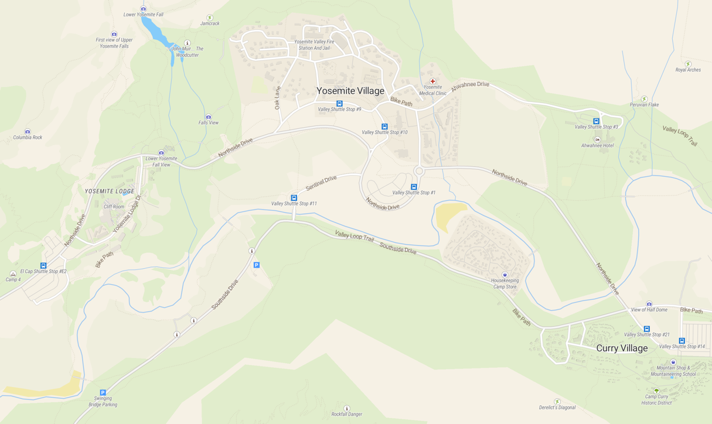

# Tegola OSM (OMT Compat) Vector Basemaps

This document outlines everything necessary to build, from scratch, an
operational OpenStreetMap vector tile server. The stack consists of
the latest LTS Ubuntu Server distribution, [Tegola](https://tegola.io) as
the tile server, [PostgreSQL](https://www.postgresql.org) as the database,
and the use of the open source [OpenMapTiles](https://github.com/openmaptiles/openmaptiles)
standard schema. We will be importing and updating our raw OSM data using
the `imposm3` OSM to PostgreSQL import tool via the OpenMapTiles toolchain.

---

Maintained by:
```bash
Andrew DeChristopher <me@dchr.host>
```

## Outline
1. [Prerequisites](#1-prerequisites)
2. [Standing up Postgres](#2-standing-up-postgres)
3. [OpenMapTiles Configuration](#3-openmaptiles-configuration)
4. [OSM Import Configuration](#4-osm-import-configuration)
5. [Tile Server Configuration](#5-tile-server-configuration)
6. [Updating Data](#6-updating-data)
7. [Integration](#7-integration)
8. [Example](#8-example)
9. [Conclusions](#9-conclusions)


## 1. Prerequisites

### _Important_:
We will be operating out of the `/osm` directory. Create it and ensure proper
permissions are set to your administrative user. Nothing during the import
process will be run as your user. All actions are run from pre-built docker
containers which makes setup replicable and easy for us. **We recommend operating
as root** for the initial setup process since libraries and files will need to be
copied around to various system directories.

This guide assumes decent foundational knowledge of systems administration on
Linux hosts, PostgreSQL, and Docker.

### Docker

The OpenMapTiles toolchain, as mentioned, runs out of docker containers. Let's make
sure we have it installed:
```bash
sudo apt-get install docker.io

sudo usermod -aG docker <your username>

docker ps
```

If you get an error after running `docker ps`, just log out and log back in. This
is usually due to the permissions to access the docker daemon not having taken
effect yet.

### Golang

The server will need Golang to run the `imposm3` OSM import tool. Install it
with the snap package manager for the easiest time:
```bash
sudo snap install go
```

### Imposm3

Depending on the use case, you can install `imposm3` to manually configure and run
data updates. This isn't necessary for the initial data import.

Clone and install `imposm3` with the following commands:
```bash
go get github.com/omniscale/imposm3

go install github.com/omniscale/imposm3/cmd/imposm3
```

If this does not work, you will simply have to run `imposm3` using the
prebuilt binary. More on this later.

### PG GZip Extension

Postgres does not ship with a GZip extension out of the box. OpenMapTiles'
layer functions require it to compress tiles over the wire.

Begin by cloning the pgsql-gzip repo within `/osm`

```bash
git clone https://github.com/pramsey/pgsql-gzip
```

Enter the repo directory. We'll need a few prerequisite libraries before we
can build the extension from source. Run:
```bash
sudo apt-get install build-essential zlib1g-dev postgresql-server-dev-all pkg-config
```

Once that's succeeded, we can move forward with building the extension:
```bash
make

#important to run as sudo if not already root
sudo make install
```

If the compilation and installation succeeded, you'll have the extension's
control files listed within your postgres extension directory. Run the following
to discover your share directory:

```bash
pg_config --sharedir

# Should be something like:
# /usr/share/postgresql/<VERSION>
```

Remember this directory, we'll need it later. Your extensions directory is
a subdirectory named `extension` under the share directory. Let's make sure
all is right:

```bash
ls $(pg_config --sharedir)/extension | grep gzip

# You should see the following:
gzip--1.0.sql
gzip.control
```

If you don't see `gzip.control` and its accompanying sql file. Try to
run the DEB package installation process outlined in the README.md in
the repo. If that fails, try your best to troubleshoot the compilation
and subsequent extension installation process. Being root helps.

### OSM Localization Extension

The linchpin to this all working together is the `osml10n` extension.
Short for OSM Localization, this PG extension will translate and transcribe
other languages with different alphabets into the standard [International
Phonetic Alphabet](https://en.wikipedia.org/wiki/International_Phonetic_Alphabet)
to give us the best user experience when viewing labels on the map that are
sourced from data in different languages.

The `osml10n` [project on Github](https://github.com/giggls/mapnik-german-l10n),
currently the only working fork of the original project, is targeted to be built
on Debian-derived linux distributions like Ubuntu. This guide assumes a vanilla
PostgreSQL v13+ server installed on the latest long-term-support version of Ubuntu.

The OSM Localization extension is very simple to build on a Debian/Ubuntu
system. Please don't waste your time sifting through compatible packages
on other distributions. It is possible, but it just stinks to get working.

Clone the repo into `/osm`
```bash
git clone https://github.com/giggls/mapnik-german-l10n
```

Enter the repo directory and begin by installing the required libraries:
```bash
sudo apt-get install devscripts equivs

sudo mk-build-deps -i debian/control
```

Install python3 and pip3 if not already installed and add the Thai transcription
library:
```bash
sudo pip3 install tltk
```

On success, simply compile the DEB package. It should take a minute or two:
```bash
make deb
```

In the root of the repo, you'll now see plenty of new control files and compiled
extensions. Lucky for us, we don't have to toss those around manually.

The makefile dropped a nice deb package one level up in the `/osm` directory for us!

```bash
cd /osm && ls

# you'll see some sort of
# postgresql-<VERSION>-osml10n_<VERSION>_amd64.deb

# Install it with dpkg
sudo dpkg --install postgresql-<VERSION>-osml10n_<VERSION>_amd64.deb
```

Once that finishes a few seconds later, let's make sure everything's in order.

```bash
ls $(pg_config --sharedir)/extension | grep osml10n

# You should see something like the following:
osml10n--2.5.8--2.5.9.sql
osml10n--2.5.9.sql
osml10n.control
osml10n_country_osm_grid.data
osml10n_thai_transcript--2.5.8--2.5.9.sql
osml10n_thai_transcript--2.5.9.sql
osml10n_thai_transcript.control
```

At this point, we're ready to configure Postgres!


## 2. Standing Up Postgres

In this step, we'll create an OSM database, user, and bootstrap all the
extensions we required in the last step.

SU into the postgres user:
```bash
sudo su postgres
```

Let's create an OSM user, as well as our OSM table:
```bash
createuser --no-superuser --no-createrole --createdb osm

createdb -E UTF8 -O osm osm
```

Now we can bootstrap our extensions and secure the `osm` user:
```bash
psql -d osm -c "CREATE EXTENSION postgis;"
psql -d osm -c "CREATE EXTENSION hstore;"
psql -d osm -c "CREATE EXTENSION gzip;"
psql -d osm -c "CREATE EXTENSION osml10n CASCADE;"
```

If all of that succeeded, especially the `osml10n` extension, then you're
good to go! Otherwise, you're going to have to go do some debugging and figure
out why the extensions weren't loaded properly. The output is usually fairly
useful. Remember that lots of the `osml10n` libraries (`.so` files) were compiled
and left within the root of the repo. You can manually drop them into their
proper directories if need be.

Just a bit of housekeeping here. Let's ensure that the osm user retains access to the
osm db and schemas within it even if we have to nuke them in the future for something:
```bash
psql -d osm -c "GRANT ALL ON ALL TABLES IN SCHEMA public TO osm;"
psql -d osm -c "ALTER DEFAULT PRIVILEGES FOR USER osm IN SCHEMA public GRANT ALL ON TABLES TO osm;";
psql -d osm -c "ALTER DEFAULT PRIVILEGES FOR USER osm IN SCHEMA public GRANT ALL ON SEQUENCES TO osm;";
```

Let's secure our `osm` user:
```bash
echo "ALTER USER osm WITH PASSWORD 'surreptitious';" | psql -d osm;
```

**Please use a password more secure than this!!**

If your tile server will be run from a server separate from the one hosting your OSM
database, you'll have to modify `postgresql.conf` and `pg_hba.conf` to allow remote
connections.

These files are located in: `/etc/postgresql/<VERSION>/main/`

In `postgresql.conf` change:
```bash
listen_address = 'localhost'

TO

listen_address = '*';
```

In `pg_hba.conf` add this line to the end of the file:
```bash
host    all             all             all                     md5
```

Then restart the PG server with: `sudo service postgresql restart`

From now on, we'll need environment variables set up to access the db through psql
and our other import tooling. Let's do so now. Create a file in the home directory
named `.osmenv` with the contents:

```bash
export PGUSER=osm
export PGPASSWORD=surreptitious
export PGHOST=127.0.0.1
export PGPORT=5432
export PGDATABASE=osm
```

Then run:
```bash
chmod 700 ~/.osmenv
source ~/.osmenv
```

The environment variables should now be present in your session. You can make sure
with the `env` command to list all the current environment variables.

With the database primed and ready, we can begin the OpenMapTiles configuration.


## 3. OpenMapTiles Configuration

OpenMapTiles has built an excellent [db schema](https://openmaptiles.org/schema) and
toolset that we'll need to import to be able to use their
[open source styles](https://openmaptiles.org/styles/).

Clone their repo into `/osm`

```bash
git clone https://github.com/openmaptiles/openmaptiles
```

Enter the repo directory. We'll need to have docker installed for this next part. If
it isn't already installed, please do so now. Run `docker ps` to make sure your user
has access to the docker daemon. Again, this guide will not outline any docker
troubleshooting. It assumes you have basic proficiency in docker and docker-compose.
There are plenty of resources available to troubleshoot things if need be.

First off, let's generate the OpenMapTiles schema migrations and imposm3 mappings.

```bash
make
```

We're going to have to make a few adjustments to the default config. OpenMapTiles repo
is tailored by default to those that actively work on the schema itself and drive it
forward, not to those that run it in production. Luckily this isn't too much of a lift.

Open the docker-compose.yml in the root of the repo in your text editor of choice.
Change the port line in the postgres service to any other port than the default:

```yaml
services:

  postgres:
    image: "${POSTGIS_IMAGE:-openmaptiles/postgis}:${TOOLS_VERSION}"
    volumes:
      - pgdata:/var/lib/postgresql/data
    networks:
      - postgres_conn
    ports:
      - "2345" # <-- CHANGE THIS TO ANYTHING BUT 5432
    env_file: .env-postgres
```

We make this change to prevent port overlap with your PG server running locally. If not
changed, the import tooling gets confused and uses the containerized PG server. We don't
want to confuse the lad.

Next, we'll edit the `.env` file in the repo, which the tooling uses to populate the
PG connection data and credentials. Change the lines up top to what we defined in your
`.osmenv` earlier. If anything in here is wrong, the tools will fail, and they will make
sure you know they did.

**NOTE: Ignore the warning about keeping the values in sync with `.env-postgres`. This
is only necessary if running the docker postgres container bundled into the tooling which
we are not.**


## 4. OSM Import Configuration

OpenMapTiles is a lovely amalgamation of geo data from various open sources across the web.

Sources are currently: OSM, OSMData, OSM Lake Labels, NaturalEarth, and Wikidata.

We'll start off by dumping the latest OSMData, NaturalEarth, and OSM Lake Labels data
into our database:

```bash
make import-data
```

When this finishes, verify the tables are present in your db. We can now start the process
that'll take 95% of the time we're going to spend rolling out our OSM basemaps: the import.

For any import for a region smaller than the entire planet, you can look up the ID of the
region on [Geofabrik](http://download.geofabrik.de/). This id can be used to run an import
for just that region.

For example, to download just Massachusetts data, you'd run:

```bash
make download area=massachusetts
```

For the entire planet:
```bash
make download area=planet
```

To ensure our cache location is in the best place possible, i.e. an SSD, we can set the
`IMPOSM_CACHE_DIR` environment variable to a directory of our choosing. Add it to your
`.osmenv` file and re-source it before running an import.

The OSM data download directory is hardcoded to the `data` directory within the
OpenMapTiles repo. You can change this in the Makefile, but it isn't very worth it for
import performance. Just keep all your files on fast storage, and the PG tables on even
faster storage if at all possible.

**DO NOT initiate the import from an SSH session without protecting it with tools like
`screen`, `tmux`, or even just unix backgrounding. If not done, the import process will
quit if you lose your SSH session along with all the import progress. These imports
cannot be resumed, forcing you to start from the beginning.**

It's time for the import using `imposm3`. Run:
```bash
make import-osm
```

This process will take anywhere from 5-10 minutes for a region as large as a state or
European country, all the way to multiple days for the entire planet depending on your
hardware. Be patient and don't bail out of the import if it does not appear to be
making any progress. Monitor system IO with `htop`, `iotop`, and `iftop`.

If the import fails for any reason, you will see error output. In the case of a SQL issue
check that you properly installed all extensions earlier. If PG runs out of space, you
will need to expand the device PG stores tables on or move it entirely to a larger drive.
Keep an eye on current disk utilization with:

```bash
watch -n 15 "df -h" | grep "<your drive>"
```

It's worth noting here, in the case that you aren't familiar with `imposm3`, that the
import runs in three stages. The first stage unpacks the raw binary protocol buffer that
your OSM data was downloaded as. The importer indexes and caches everything in an on-disk
LevelDB. This on-disk cache takes up a lot more space than the raw downloaded OSM data.
My estimate is usually 3-4 times the size of the `.osm.pbf` file downloaded. Keep this
in mind when building out the DB server. You'll want enough storage space to keep the
raw data, the on-disk cache, and the PG tables all at the same time.

If you're strapped for disk space, you can monitor the import and nuke the raw data
as soon as the first stage is done. Stage two begins and writes the data from the
on-disk cache directly to your database, so you can safely get rid of the raw data here.
**Be mindful that you may need the raw data to retry from the beginning if something goes
wrong with the import.** Stage two, in general, is where you'll want to state keeping an
eye on disk usage.

Stage three creates indexes and optimizes the tables before deploying them. Indexes can
also cause fairly large disk usage. Be mindful here and make sure you don't run out of
space. If you fill up, you'll have to re-run the whole import after expanding storage
since this stage cannot be resumed from the middle.

`imposm3` keeps a three-schema architecture in place to keep your data intact during an
update. The `import` schema contains tables being actively imported. Your first import
will sit in here before the importer deploys the tables to the `public` schema. When new
tables are deployed to the `public` schema, the existing tables are rotated into the
`backup` schema for safe keeping in the case of an issue with the tables you just deployed.
It's worth reading up on `imposm3` documentation to learn how to manually roll back a
deployment.

When the import completes (hopefully without error), you have a few more small steps to
complete before we can use the data.

First, create the borders tables with:
```bash
make import-borders
```

This may take a while.

If an OSM feature has key:wikidata, OpenMapTiles checks
the corresponding item in Wikidata and uses its labels for languages listed in the
`openmaptiles.yaml` in the repo.

Generated vector tiles will contain multiple languages in the name fields for objects,
making our tiles able to be displayed for users using default languages other than
English.

Import labels from Wikidata:
```bash
make import-wikidata
```

The last and arguably most tense step in this process is importing OpenMapTiles layer
generation functions, views, and additional indices. This is the bread and butter that
defines all the usable source layers contained in our generated vector tiles. Index
and materialized view creation in this stage will consume additional disk space. Keep
an eye out. Luckily this stage can be "resumed" if you hit a snag and need to add more
disk space

Simply run:
```bash
make import-sql
```

Cross your fingers. I've seen this script fail for so many reasons. If you followed
this guide exactly, you should not have an error thrown at you. In case you do,
however, you can comb through the generated sql files in `build/sql` in the repo to
diagnose any possible issues. I've ocassionally had to manually run some of these
when doing a full planet import while testing this guide. No conclusions have yet
been made as to what the cause is.

Re-running make `import-sql` is not harmful. Correct issues and re-run the script if
you need to.

**If you got this far with no issues, you need to pat yourself on the back. It is done.**


## 5. Tile Server Configuration

As previously mentioned, this guide assumes the use of the Tegola tile server.

The assumption is made that you've followed the
[Tegola docs](https://tegola.io/documentation/) to stand up a cluster of tile server
instances on your own. Their docs are great and plenty of additional help is available
on their [GitHub issues](https://github.com/go-spatial/tegola/issues).

You are going to want some sort of caching enabled. S3 is fine, file caching is great
if you've got a ton of fast SSD storage, and Redis is a decent option if you want to
pay for it.

You will find an example Tegola `config.toml` alongside this README with all available
tile layers defined. [Reference the OpenMapTiles schema](https://openmaptiles.org/schema/)
for fields to pull from the layer functions in the case that this guide becomes outdated.


## 6. Updating Data

// TODO coming soon


## 7. Integration

The vector tile server stack you just created may now be used with any MVT-compatible
mapping library such as [MapboxGL.js](https://www.mapbox.com/mapbox-gljs),
[Leaflet](https://leafletjs.com) using the
[MapboxVectorTile plugin](https://github.com/SpatialServer/Leaflet.MapboxVectorTile),
or [OpenLayers](https://openlayers.org) using the built-in
[MVT source](https://openlayers.org/en/latest/examples/mapbox-vector-tiles.html).

You'll need to load a style to actually view the MVT tiles on your map. You can create
your own style using the [Maputnik](https://maputnik.github.io/) visual style editor
for the [Mapbox Style Specification](https://www.mapbox.com/mapbox-gl-js/style-spec).

This repository contains an example `style.json` derived from the MapTiler Streets style.
Font stacks and sprite sheets are included in the `carto` directory and must be hosted
alongside the tiles on some webserver. Be sure to change the URL to the tiles, glyphs,
and sprites in the `style.json` when deploying. There are a few issues with sprites for
various icons, most notably highway icons. A PR investigating and fixing would be appreciated.

Alternatively, you can use one of many
[open-source MVT styles](https://openmaptiles.org/styles/) compatible with the
OpenMapTiles schema, made available from the OpenMapTiles contributors and team.
Here are links to a few:

| Name             | Source                                                              | Preview                                                                   |
| ---------------- | ------------------------------------------------------------------- | ------------------------------------------------------------------------- |
| MapTiler Basic   | [GitHub](https://github.com/openmaptiles/maptiler-basic-gl-style)   | [MapTiler Cloud](https://www.maptiler.com/maps/#basic//vector/1/0/0)      |
| OSM Bright       | [GitHub](https://github.com/openmaptiles/osm-bright-gl-style)       | [MapTiler Cloud](https://www.maptiler.com/maps/#bright//vector/1/0/0)     |
| Positron         | [GitHub](https://github.com/openmaptiles/positron-gl-style)         | [MapTiler Cloud](https://www.maptiler.com/maps/#positron//vector/1/0/0)   |
| Dark Matter      | [GitHub](https://github.com/openmaptiles/dark-matter-gl-style)      | [MapTiler Cloud](https://www.maptiler.com/maps/#darkmatter//vector/1/0/0) |
| MapTiler Terrain | [GitHub](https://github.com/openmaptiles/maptiler-terrain-gl-style) | [MapTiler Cloud](https://www.maptiler.com/maps/#topo//vector/1/0/0)       |
| MapTiler 3D      | [GitHub](https://github.com/openmaptiles/maptiler-3d-gl-style)      | N/A                                                                       |


## 8. Example

A full-stack example exists in this repo within the `test` directory. You will need to
edit the `style.json` within `test/public` to point to your tileserver properly after you've
rolled it out. Additionally, the URLs to the sprites and glyphs will work out of the box in
the example `style.json` since they're copied to the `public` directory.


## 9. Conclusions

You've done it. Congratulations! Vector tile basemaps are the future. Hopefully, you'll
think so as well after using them in production for a bit.


